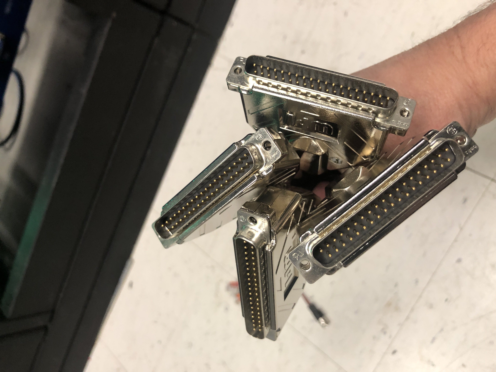
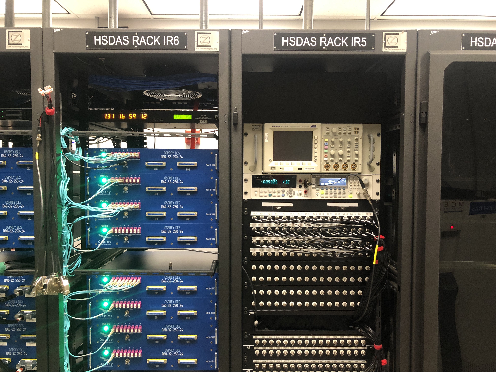
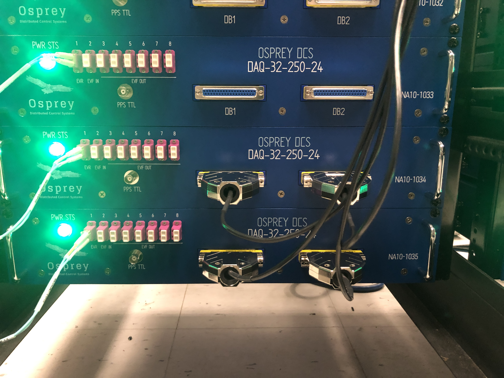
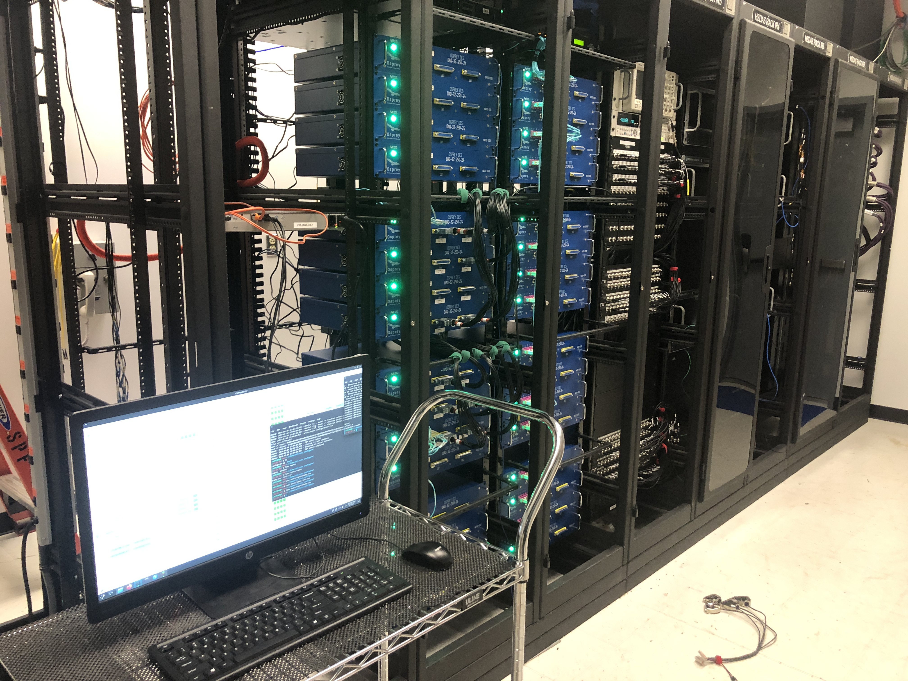
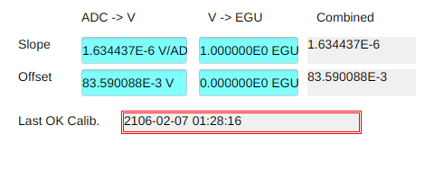

# D.4.2 : ATF SEC Measurement Device Calibration Procedure

## D.4.2.1 Introduction
This procedure is to be followed when it is deemed necessary to establish a new set of calibration data for the Quartz
ADC boards. 

## D.4.2.2 Summary
In this procedure, one person (the operator) will be responsible for all tasks described. 
The operator will connect the calibration source (function generator and precision DVM) to the Quartz ADC chassis 
(up to two at a time) and run a calibration script via the command-line interface. 
This will be repeated for each ADC chassis as required.

## D.4.2.3 Preparing for calibration : hardware
- [D.4.2.3.1] Locate the calibration cable set typically stored <where?> (see photo 1a-c). This assembly distributes the 
calibration voltage to (up to) two Quartz ADC chassis. On one side there are qty 4 DB-37(M) connectors for attaching to
the ADC chassis, and on the other side there is a single BNC connector for attaching the excitation voltage source.  

Photo 1-a (calibration cable set):   
Photo 1-b (DB-37 connectors):   
Photo 1-c (BNC connector):   

- [D.4.2.3.2] In the DAQ room, attach the BNC end of the calibration cable set to the BNC cable coming off the tee on the 
Agilent 33220 Waveform generator. Verify the other end of this tee is attached to the adjacent Agilent 34410A DVM with
short BNC cable.  

Photo 2 (DVM and Waveform generator):   

- [D.4.2.3.3] Route the calibration cable set to the Quartz ADC chassis to be calibrated. *If necessary* an intermediary BNC cable can be
added between the BNC tee and the calibration cable set.  

Photo 3 (Calibration cable connection and routing):   

- [D.4.2.3.4] With moderate force, connect the DB-37 ends of the calibration cable set to the Quartz ADC chassis to be 
calibrated. **Take care** to push straight into the chassis without undue force either up or down.
- [D.4.2.3.5] If not already powered on, switch on the Agilent 33220 Waveform generator and the 34410A DVM.

Photo 4-a (Unterminated Quartz chassis):   
Photo 4-b (Terminated Quartz chassis):   

### Network configuration

- DVM IP address: `192.168.83.47`
- Waveform generator IP address: `192.168.83.48`

Connect to ports 47 and 48 of the network switch.

## D.4.2.4 Preparing for calibration : software
- [D.4.2.4.1] Log on to the DAQ Server.
  Either connect local keyboard and monitor as shown,
  or remote via SSH to `192.168.83.100`.

Photo 5 (Operator terminal): 

## D.4.2.5 Perform calibration(s)
- [D.4.2.5.1] The following procedure will be executed for each set of chassis to be calibrated.  
**NOTE** Even though the setup procedures above connects (up to) two Quartz ADC chassis at a time, the calibration 
procedure only performs one at a time. 
- [D.4.3.5.2] Verify the calibration cable set is connected properly to the chassis to be calibrated. If not, move a pair of
DB-37 connectors to the chassis to be calibrated.
- [D.4.2.5.3] On the terminal, enter `quartz_calib {nn} {y|n}`


Where nn is the chassis number (two digits) and **y|n** designates if the script
will push the calibration constants directly to EPICS.
Set `y` for a real calibration, or `n` for a "practice" run.

eg. for a real calibration of chassis 17.

```
quartz_calib 17 y
```

- [D.4.2.5.4] Monitor the terminal as the calibration procedure is carried out and verify it completes in full. If the
"Push calibration constants direct to EPICS" option was chosen above, also verify on the OPI that the current
calibration date and time are valid and reasonable (matching the current date and time).  

Image 1a (Valid calibration):  
  

Image 1b (Invalid calibration):  
  

- [D.4.2.5.5] Verify two calibration files were created with a name of the form:  
`{calib_date}_{file_time}_cal_{chassis_id}_bipolar_raw.csv`  
and  
`{calib_date}_{file_time}_cal_{chassis_id}_bipolar_calc.csv` 
- [D.4.2.5.6] Repeat steps D.4.2.5.2 through D.4.2.5.5 above for each chassis needing calibration.
- [D.4.2.5.7] **If it appears the calibration procedure has failed** (as noted by a message on the console, incorrect
time-stamp on the OPI, or missing data files):
- [D.4.2.5.7.1] Verify:
  1. The waveform generator and DVM are both powered on
  2. The connections to the Quartz chassis being calibrated are correct and secure  
- [D.4.2.5.7.2] If either of the above checks appear to be misconfigured, correct and retry the calibration.
- [D.4.2.5.7.3] If the above checks did not reveal anything anomalous, **stop the calibration process** and contact a 
control system SME for further analysis.

## D.4.2.6 Archive calibration data
- [D.4.2.6.1] At the end of the calibration runs, copy the calibration data to the archive location as required by ATF SEC.

## D.4.2.7 Cleanup
- [D.4.2.7.1] Upon the conclusion of the calibration session, disconnect the calibration cable set (being sure to leave the BNC 
tee connected to the function generator (along with the long BNC cable) and the connection to the DVM intact.)
- [D.4.2.7.2] Log off of the terminal and exit the DAQ room, being sure to return the calibration cable set to the location where
it is stored.

