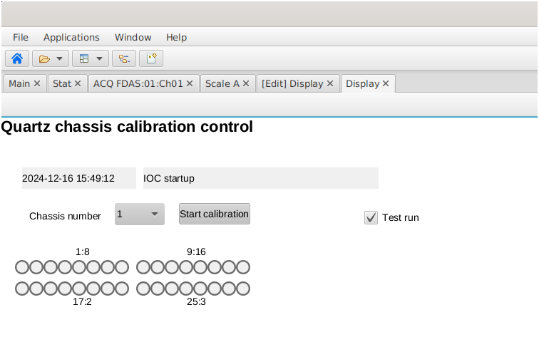
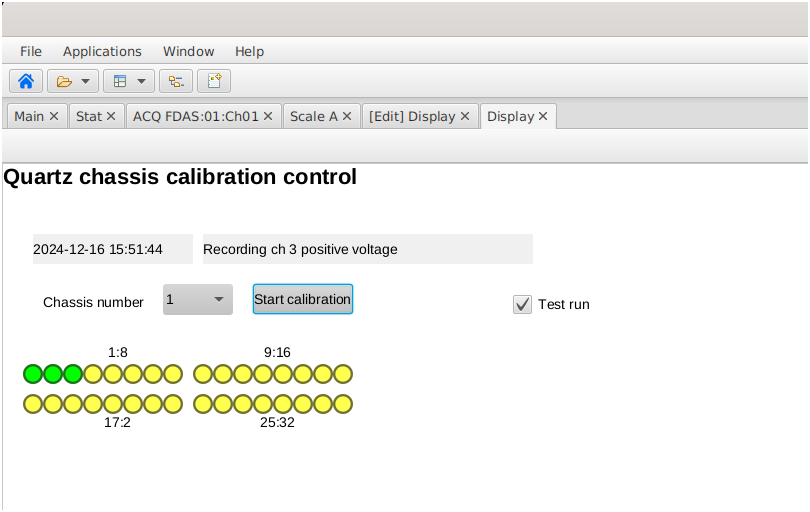
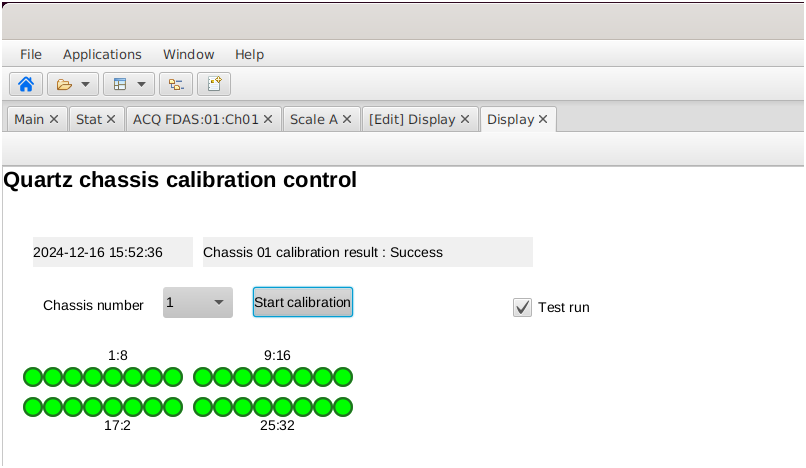

First go at an ioc based calibration routine

be sure the IP numbers are appropriate for the particular DMM and AFG (see source code)

invoke the virtual environment 

invoke the ioc with `python calibrateIoc.py`

the bob file is the css screen to interact with the ioc (start the calibration routine)

(Initial screen): 

(In progress screen): 

(Successful calibration): 
